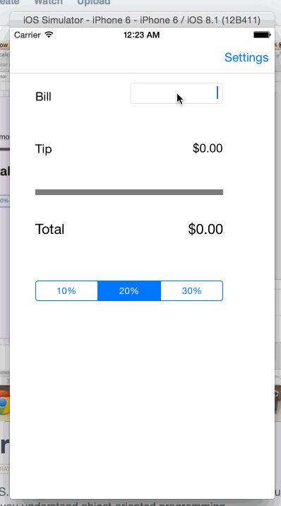

# ios-app-tipcalculator
This is an IOS application for calculating the tip . 

Time spent: 7 hours spent in total

Completed user stories:

    Required: User can enter bill and see the total based on the amount he wants to tip 
    Required: User can set default tip percentage 
    Optional: While navigating back from setting window to main window the total amount is automatically calculated using selected default tip percentage. 
    
    

Walkthrough of all user stories:

 
